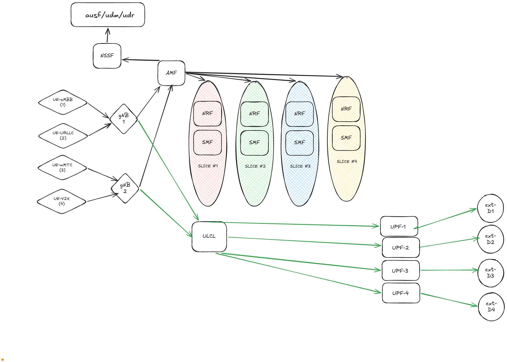

# 📡 5G Standalone (SA) Infrastructure with Network Slicing


[View IP Addressing Diagram (PDF)](./docs/IP_ADDRESSAGE.pdf)

## 📖 Overview

This project provides an advanced, fully containerized infrastructure designed to emulate a complete **5G Standalone (SA) architecture** with **Network Slicing** capabilities. Its primary goal is to deploy and demonstrate a robust 5G core network capable of isolating different types of traffic into distinct, dedicated logical networks (slices) to ensure tailored Quality of Service (QoS) for various applications.

This environment relies heavily on **OpenAirInterface (OAI)** for the 5G Core Network, **VPP (Vector Packet Processor)** for data plane acceleration, and **UERANSIM** to emulate the Radio Access Network (gNBs and UEs).

As a practical demonstration of its capabilities, the infrastructure currently hosts a connected ambulance use case on top of the network slices, though the core infrastructure is generic and extensible to any 5G use case.

## 🏗️ Architecture & Network Slices

The architecture spans several network zones: Control Plane, RAN Access, Inter-UPF Transit, and external Data Networks. It successfully deploys **4 parallel network slices**, governed by a unified Access and Mobility Management Function (AMF) and Network Slice Selection Function (NSSF).

### Implemented Network Slices:

| Slice | SST / SD | Standard 5G Use Case | Application Example |
|---|---|---|---|
| **Slice 1** | `1 / 000001` | **eMBB** (Enhanced Mobile Broadband) | High throughput slice designed for real-time video streaming (e.g., bodycams, onboard cameras). |
| **Slice 2** | `2 / 000002` | **URLLC** (Ultra-Reliable Low-Latency Comms) | Critical latency-sensitive operations (e.g., remote surgery data, tele-driving). |
| **Slice 3** | `3 / 000003` | **mMTC** (Massive Machine Type Comms) | Designed for IoT devices and continuous telemetry (e.g., heart rate, medical sensors). |
| **Slice 4** | `4 / 000004` | **V2X** (Vehicle-to-Everything) | Real-time traffic management and priority routing communications. |

### Core Components
- **5G Core Control Plane (OAI)**: MySQL Database, NSSF, UDR, UDM, AUSF, AMF.
- **Slice-specific Controllers**: Dedicated NRF and SMF for each of the 4 slices.
- **Data Plane (OAI-UPF-VPP)**: Accelerated VPP User Plane Functions. Includes a central ULCL (Uplink Classifier) and 4 Anchor UPFs (AUPF1 - AUPF4) corresponding to each slice.
- **RAN Emulation (UERANSIM)**: Two virtual gNBs connecting 4 UEs, routing traffic through the access network to the respective UPFs.

## 📱 Deployed Applications (Use Case Example)

To test and demonstrate the network capabilities, the infrastructure hosts practical applications that leverage the network slices.

### App 1: Ambulance-App

The **Ambulance-App** simulates a highly connected emergency vehicle transmitting critical data in real-time. In a standard network, congestion could cause video lag or delay vital signs. This project solves this by routing specific traffic through dedicated 5G slices:

- **High-Definition Cameras (Video Streaming):** The ambulance is equipped with 2 cameras (e.g., dashboard and onboard patient camera). To preserve maximum video quality without frame drops, the camera feeds are routed exclusively through **Slice 1 (eMBB)**. This slice guarantees high bandwidth.
- **Medical Sensors (Telemetry):** The ambulance transmits continuous patient data (heart rate, blood pressure, etc.). This stream of small, frequent packets is routed through **Slice 3 (mMTC)**, ensuring reliable delivery even if the video slice becomes heavily loaded.

**How it works:**
By utilizing the 5G SA Core and VPP Data Plane acceleration, the project guarantees that each data stream is logically isolated from end to end (from the simulated UERANSIM UE, through the gNB, to the respective Anchor UPF). 

The application backend consists of:
- `iot-broker`: MQTT broker (Mosquitto) for mMTC telemetry ingestion.
- `ambulance-server`: Node.js based dashboard streaming real-time vitals (via Socket.io) and live camera feeds (RTMP to HTTP-FLV using Node Media Server).
- `dozzle`: Real-time log monitoring dashboard for infrastructure management.

### App 2: Augmented Reality Headset
*(Under Construction)*

### App 3: Autonomous Shuttle (Navette)
*(Under Construction)*

### App 4: Multi-slice Data Flow Visualization
*(Under Construction)*

## 🛠️ Technology Stack

- **5G Core**: OpenAirInterface (OAI) 5G Core Network (v1.5.0)
- **RAN Emulation**: UERANSIM
- **Data Plane Acceleration**: Vector Packet Processor (VPP)
- **Containerization**: Docker & Docker Compose
- **Application Layer**: Node.js, Express, Socket.io, MQTT (Eclipse Mosquitto), Node Media Server, FFmpeg

---

## 🚀 Getting Started

### Prerequisites
- **OS**: Ubuntu Linux 20.04/22.04 (Recommended due to `tun` device requirements and VPP optimizations).
- **Dependencies**: Docker (latest) and Docker Compose plugin.
- **Privileges**: Root access (`sudo`) is required to manage network namespaces and `tun` interfaces created by UERANSIM.

### 🟢 1. Booting the Infrastructure

To start the entire 5G ecosystem, including the Core, RAN, and demonstration applications, execute the following from the root directory:

```bash
sudo docker compose up -d
```
> ⏳ **IMPORTANT:** Wait approximately 30 to 60 seconds after execution. The virtual 5G network requires time for the UPFs to negotiate sessions with the SMFs and stabilize routing tables.

### 🩺 2. Initializing Telemetry Data (Application Layer)

Since the containers boot cleanly, you can copy the simulation script to the demonstration server and run it. This script generates and pushes dummy vital signs to the MQTT broker through the network.

```bash
sudo docker cp ./scripts/simulate_ambulance_vitals.sh ambulance-server:/simulate_ambulance_vitals.sh
sudo docker exec -d ambulance-server sh /simulate_ambulance_vitals.sh
```

### 📹 3. Initializing Video Feed Injection (Application Layer)

To simulate a video stream traversing the network without requiring physical hardware, deploy a temporary container that injects a test RTMP video stream directly into the media server.

```bash
sudo docker rm -f ffmpeg-gen 2>/dev/null || true
sudo docker run -d --name ffmpeg-gen \
  --network data-network-srv \
  jrottenberg/ffmpeg:4.4-ubuntu \
  -re -f lavfi -i testsrc=size=1920x1080:rate=30 -f lavfi -i sine=frequency=1000:sample_rate=44100 \
  -c:v libx264 -preset ultrafast -b:v 1000k -maxrate 1000k -bufsize 2000k -pix_fmt yuv420p \
  -c:a aac -b:a 128k -f flv rtmp://ambulance-server:1935/live/camera
```

🎉 **The system is now fully operational!** 
You can access the demonstration Application Dashboard by navigating to:
👉 `http://localhost:3001`

*(Space reserved for Dashboard UI screenshots)*

---

## 🔴 Shutting Down the System

To prevent orphaned containers, dangling `tun` interfaces, or network conflicts on subsequent boots, ensure a clean shutdown process:

**1. Destroy the video injector:**
```bash
sudo docker rm -f ffmpeg-gen
```

**2. Shutdown and remove the 5G infrastructure:**
```bash
sudo docker compose down
```

---

## 🐛 Troubleshooting

If you encounter issues during execution, use the following commands to inspect the internal state of critical components:

- **Real-time Global Logs:** Access the **Dozzle** dashboard at `http://localhost:8080` to view logs for all containers visually.
- **Check Dashboard Logs:**
  ```bash
  sudo docker logs -f ambulance-server
  ```
- **Check MQTT Broker Logs:**
  ```bash
  sudo docker logs -f iot-broker
  ```
- **Verify Video Feed Emitter:**
  ```bash
  sudo docker logs -f ffmpeg-gen
  ```

---

## 🔮 Future Roadmap

*(This section will be expanded as the project evolves)*

- [ ] Integration of physical hardware and devices (Real UEs).
- [ ] Optimization of UPF-VPP parameters
- [ ] Development of the different apps proposed.
